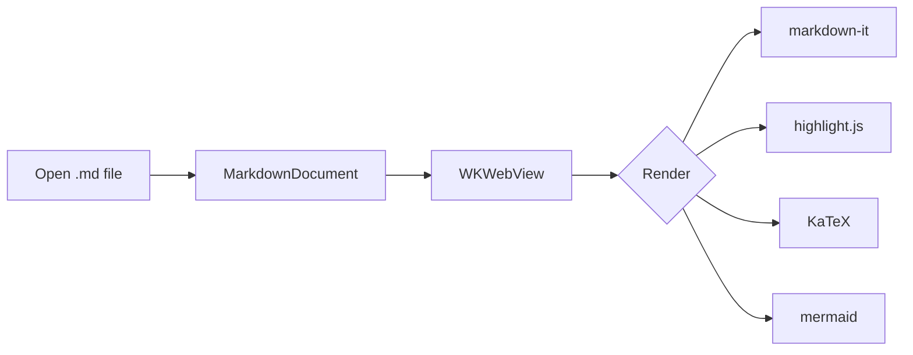
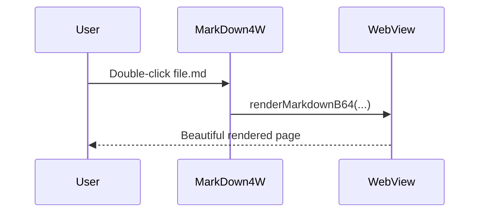

# MarkDown4W Sample Document

A quick tour of everything the renderer should handle. Welcome to **MarkDown4W**, a
native macOS markdown viewer.

## Text formatting

This paragraph has **bold**, *italic*, ***bold italic***, ~~strikethrough~~,
`inline code`, and a [link to example.com](https://example.com). Here is a
footnote-free sentence with "smart quotes" and an em-dash --- via typographer.

> Blockquotes look like this.
>
> > And they can nest, with a second level for emphasis.

## Lists

Unordered:

- First item
- Second item
  - Nested item
  - Another nested item
- Third item

Ordered:

1. Step one
2. Step two
3. Step three

Task list:

- [x] Set up the project
- [x] Render markdown
- [ ] Add editing (out of scope)
- [ ] Ship to the App Store

## Table

| Feature       | Status | Notes                    |
|---------------|:------:|--------------------------|
| GFM tables    |   ✅   | Aligned columns          |
| Code highlight|   ✅   | highlight.js             |
| Math          |   ✅   | KaTeX                    |
| Mermaid       |   ✅   | Diagrams                 |

## Code with syntax highlighting

```swift
struct ContentView: View {
    @EnvironmentObject var settings: AppSettings
    var body: some View {
        Text("Hello, MarkDown4W!")
            .font(.title)
            .padding()
    }
}
```

```python
def fib(n: int) -> int:
    a, b = 0, 1
    for _ in range(n):
        a, b = b, a + b
    return a
```

```json
{ "name": "MarkDown4W", "native": true, "edit": false }
```

## Math (KaTeX)

Inline math: the mass-energy relation is $E = mc^2$, and Euler's identity is
$e^{i\pi} + 1 = 0$.

Block math:

$$
\int_{-\infty}^{\infty} e^{-x^2}\,dx = \sqrt{\pi}
$$

$$
\frac{\partial}{\partial t}\,\Psi = \frac{i\hbar}{2m}\nabla^2 \Psi
$$

## Mermaid diagram





## Images


## Horizontal rule

---

That's the whole tour. Smooth scrolling, switchable fonts, and light/dark themes
should all just work.
